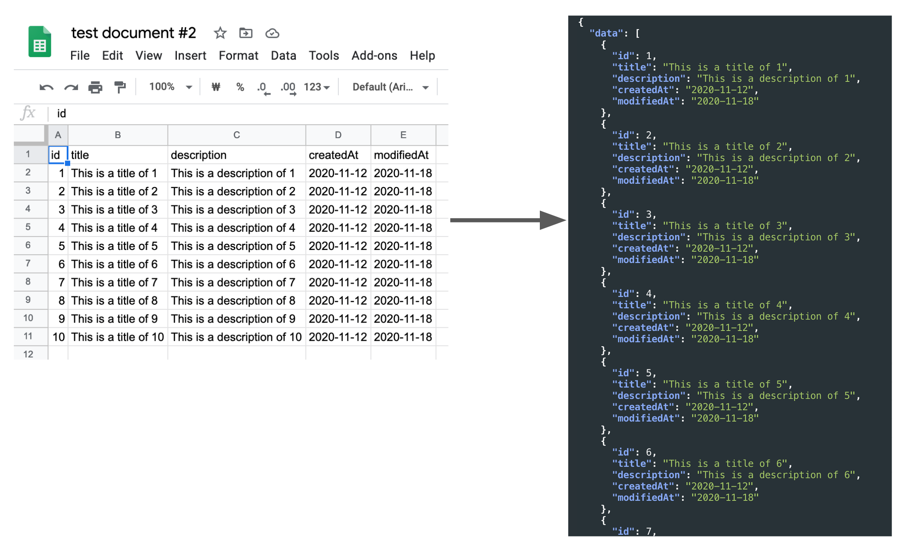

# Public Google Sheets Parser

[](https://github.com/fureweb-com)
[](https://img.shields.io/github/checks-status/fureweb-com/public-google-sheets-parser/main)
[](https://www.npmjs.com/package/public-google-sheets-parser)
[](https://codecov.io/gh/fureweb-com/public-google-sheets-parser)
[](https://github.com/fureweb-com/public-google-sheets-parser/blob/main/LICENSE)
[](https://standardjs.com)
[](https://hits.seeyoufarm.com)
[](https://github.com/fureweb-com/public-google-sheets-parser/stargazers)
[](https://www.npmjs.com/package/public-google-sheets-parser)
[](https://www.jsdelivr.com/package/npm/public-google-sheets-parser)



### Demo page
[https://fureweb-com.github.io/public-google-sheets-parser/](https://fureweb-com.github.io/public-google-sheets-parser/)


It is a simple and **zero dependency** parser that helps you use public Google sheets document as if they were a database.


The document that you intend to use must be a Google Sheet that is set to "public" and must contain a header in the first row. For instance, [you can use a Google Sheet like the one in the example provided](https://docs.google.com/spreadsheets/d/10WDbAPAY7Xl5DT36VuMheTPTTpqx9x0C5sDCnh4BGps/edit#gid=1839148703).

You have the option to specify the name of the sheet's tab to retrieve data from a specific sheet. **This feature has been available since version 1.1.0.** Additionally, you can also specify the sheet's GID to obtain data from a specific sheet. **This feature has been added since version 1.3.0.**

It does not work in browsers where the [fetch API](https://caniuse.com/fetch) is not available.

**No API key required.** This means that the server does not need to use the private key to use the SDK.

You can also use it via free API. Please see [this documentation](https://api.fureweb.com).
If you have a public spreadsheet document, and the first row is a header and you have more than one row of data, you can call it free of charge through this API and use the result as a JSON response.


### Installation

With yarn:
```bash
$ yarn add public-google-sheets-parser
```

With npm:
```bash
$ npm i public-google-sheets-parser
```

### Usage example
- Node.js
```js
const PublicGoogleSheetsParser = require('public-google-sheets-parser')

const spreadsheetId = '10WDbAPAY7Xl5DT36VuMheTPTTpqx9x0C5sDCnh4BGps'

// 1. You can pass spreadsheetId when instantiating the parser:
const parser = new PublicGoogleSheetsParser(spreadsheetId)
parser.parse().then((items) => {
  // items should be [{"a":1,"b":2,"c":3},{"a":4,"b":5,"c":6},{"a":7,"b":8,"c":9}]
})

// 2. You can change spreadsheetId on runtime:
const anotherSpreadsheetId = '1oCgY0UHHRQ95snw7URFpOOL_DQcVG_wydlOoGiTof5E'
parser.id = anotherSpreadsheetId
parser.parse().then((items) => {
  /* items should be
  [
    {"id":1,"title":"This is a title of 1","description":"This is a description of 1","createdAt":"2020-11-12","modifiedAt":"2020-11-18"},
    {"id":2,"title":"This is a title of 2","description":"This is a description of 2","createdAt":"2020-11-12","modifiedAt":"2020-11-18"},
    ...
  ]
  */
})

// 3. You can pass the spreadsheet ID when call parse method:
parser.parse(spreadsheetId).then((items) => {
  // items should be [{"a":1,"b":2,"c":3},{"a":4,"b":5,"c":6},{"a":7,"b":8,"c":9}]
})


// 4. You can also retrieve a specific sheet to get by either passing the sheet name as a string (since v1.1.0):
parser.parse(spreadsheetId, 'Sheet2').then((items) => {
  // items should be [{"a":10,"b":20,"c":30},{"a":40,"b":50,"c":60},{"a":70,"b":80,"c":90}]
})
// ...or as an object (since v1.3.0) that specifies the sheet's name or ID. If both are provided, sheet ID is used:
parser.parse(spreadsheetId, { sheetId: '784337977' }).then((items) => {
  // items should be [{"a":10,"b":20,"c":30},{"a":40,"b":50,"c":60},{"a":70,"b":80,"c":90}]
})

// Sheet name or sheet ID can also be passed during instantiation:
const parser = new PublicGoogleSheetsParser(spreadsheetId, { sheetId: '784337977'})
parser.parse().then((items) => {
  // items should be [{"a":10,"b":20,"c":30},{"a":40,"b":50,"c":60},{"a":70,"b":80,"c":90}]
})


```

You can use any of the 4 methods you want!

- with import (Vue.js or whatever)
```js
// templates...

import PublicGoogleSheetsParser from 'public-google-sheets-parser'

export default {
  data () {
    return {
      items: [],
    }
  },
  computed: {
    parser () {
      return new PublicGoogleSheetsParser()
    },
  },
  methods: {
    async getItems (spreadsheetId) {
      this.items = await this.parser.parse(spreadsheetId)
    },
  },
}

// styles...
```


- browser
```html
<script src="https://cdn.jsdelivr.net/npm/public-google-sheets-parser@latest"></script>

<script>
const spreadsheetId = '10WDbAPAY7Xl5DT36VuMheTPTTpqx9x0C5sDCnh4BGps'
const parser = new PublicGoogleSheetsParser()
parser.parse(spreadsheetId).then((items) => {
  // items should be [{ a: 1, b: 2, c: 3 },{ a: 4, b: 5, c: 6 },{ a: 7, b: 8, c: 9 }]
})
parser.parse(spreadsheetId, 'Sheet2').then((items) => {
  // items should be [{ a: 10, b: 20, c: 30 }, { a: 40, b: 50, c: 60 }, { a: 70, b: 80, c: 90 }]
})
</script>
```

- free API ([documentation](https://api.fureweb.com))

```sh
curl -X GET "https://api.fureweb.com/spreadsheets/10WDbAPAY7Xl5DT36VuMheTPTTpqx9x0C5sDCnh4BGps" -H "accept: */*"

# response (application/json)
{"data":[{"a":1,"b":2,"c":3},{"a":4,"b":5,"c":6},{"a":7,"b":8,"c":9}]}
```
**That's it!**

